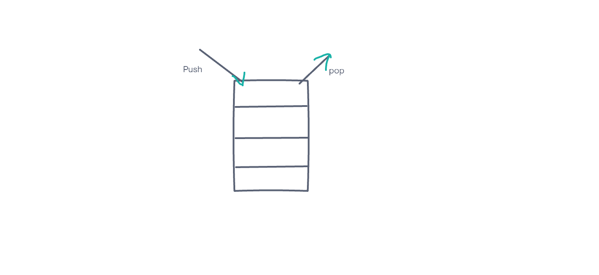

# Memory Storage

## Call Stack

1. What is a ‘call’?

    - A function invocation

2. How many ‘calls’ can happen at once?

    - Just one

3. What does LIFO mean?

    - Last In First Out

4. Draw an example of a call stack and the functions that would need to be invoked to generate that call stack.

    

5. What causes a Stack Overflow?

    - When a function is called without an exit point

## Error Messaging

1. What is a ‘refrence error’?

    - Using a variable that has not been declared

2. What is a ‘syntax error’?

    - This occurs when something cannot be parsed in terms of syntax

3. What is a ‘range error’?

    - This occurs when trying to manipulate something using an invalid length

4. What is a ‘type error’?

    - This occurs when the type of data you are trying to access are incompatible

5. What is a breakpoint?

    - A breakpoint is a spot in the code where execution will stop

6. What does the word ‘debugger’ do in your code?

    - It can cause a breakpoint.

## Things I want to know more about

- Just how to properly build a stack

# Useful Links

- [Call Stack](https://www.freecodecamp.org/news/understanding-the-javascript-call-stack-861e41ae61d4/)
- [Errors](https://codeburst.io/javascript-error-messages-debugging-d23f84f0ae7c)